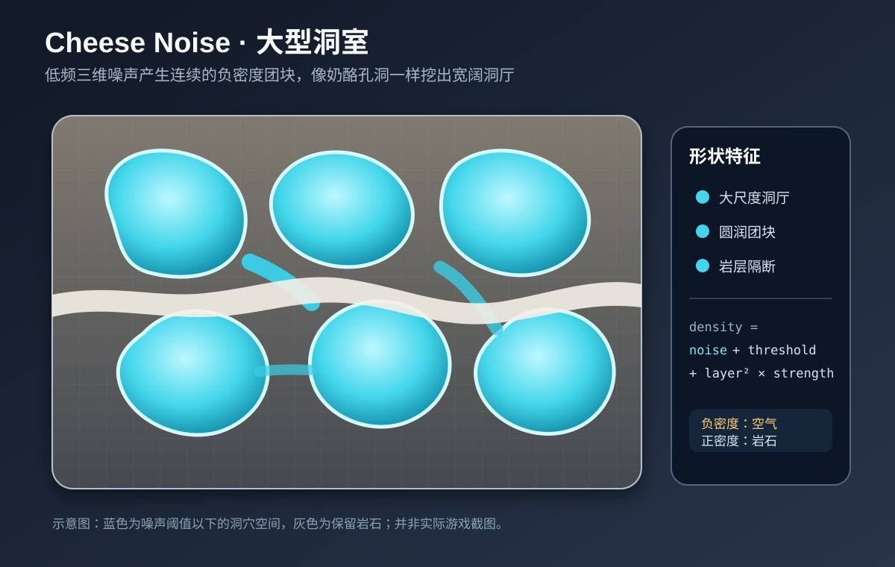
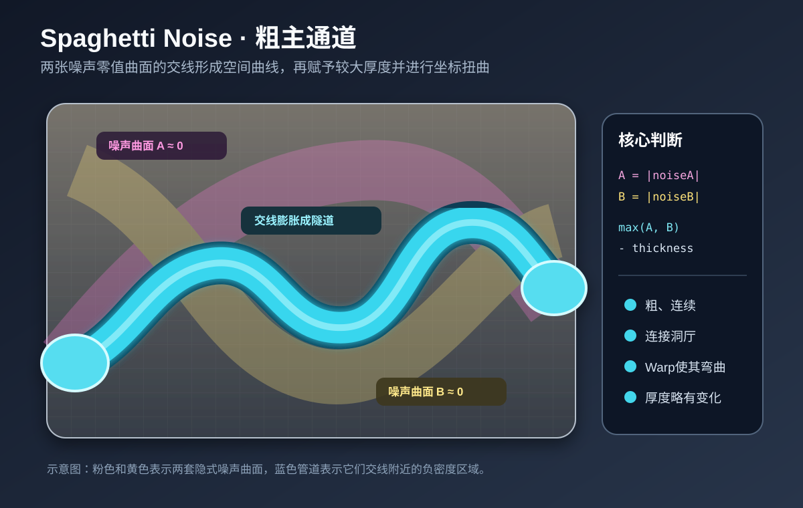
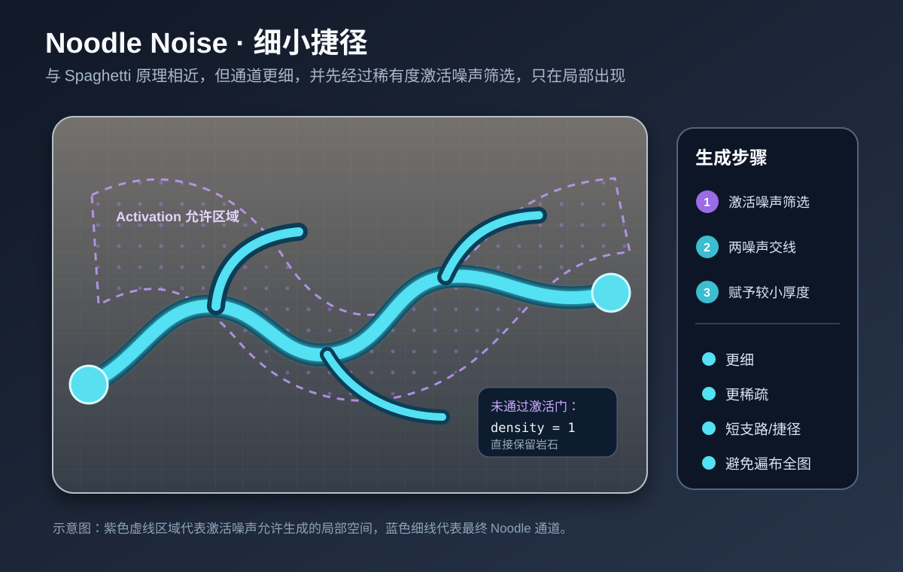
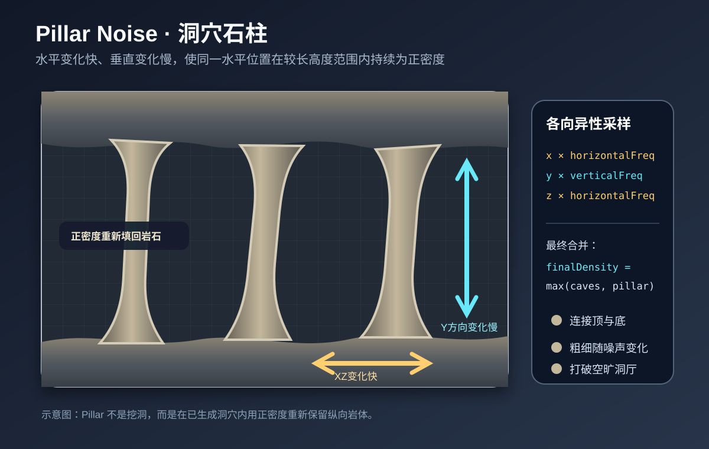

# 柏林噪声洞穴地形生成算法

本文只讨论洞穴地形，不讨论矿物、结构、生态表面或怪物生成。

## 1. 整体思路

项目不是先生成完整石块，再用随机球体挖洞，而是为世界中的每个采样位置计算一个“密度”：

```text
密度 ≥ 0：岩石
密度 < 0：空气
```

三维柏林噪声给出连续、平滑的随机值。项目把多组噪声组合成：

- Cheese：大型洞室；
- Spaghetti：粗主通道；
- Noodle：细小支路和捷径；
- Pillar：洞穴中的石柱；
- Layout Noise：限制上述形状出现的总体区域。

最终使用 Marching Cubes 提取密度为零的等值面，生成连续洞壁。

```text
世界坐标
  ↓
多组3D梯度噪声
  ↓
洞室、主通道、细通道、石柱
  ↓
低频布局噪声裁切
  ↓
最终密度
  ↓
Marching Cubes洞壁
```

---

## 2. 三维柏林噪声

洞穴需要考虑 X、Y、Z 三个方向，因此使用：

```text
Noise(x, y, z)
```

采样位置位于一个整数网格立方体中。系统根据世界种子和八个角点坐标，为每个角选择一个伪随机梯度方向，再计算角点梯度与“角点到采样位置向量”的点积。

八个结果经过 X、Y、Z 三个方向的平滑插值，得到当前位置的连续噪声值。

项目使用的平滑函数为：

\[
Fade(t)=t^3(t(6t-15)+10)
\]

因为梯度由：

```text
Seed + X + Y + Z
```

共同哈希得到，所以相同种子和绝对世界坐标永远得到相同结果。区块可以独立生成，同时在边界保持连续。

---

## 3. 分形噪声与 NormalNoise

单层柏林噪声过于单调，所以项目叠加多个 octave：

```text
每增加一层：
频率 × 2
振幅 × 0.5
```

粗尺度负责整体轮廓，细尺度负责局部凹凸。

项目的 `NormalNoise` 又混合了两套独立的分形柏林噪声：

\[
NormalNoise=
Clamp((Noise_1+Noise_2)\times0.55,-1,1)
\]

第二套噪声使用不同种子、位置偏移和轻微坐标缩放，用来降低单套柏林噪声的网格方向感和重复感。

---

## 4. Cheese：大型洞室



Cheese 密度近似为：

\[
Cheese=
MainNoise
+Threshold
+LayerNoise^2\times LayerStrength
\]

主噪声的负值区域形成连续团块，像奶酪孔洞一样产生大型洞厅。

分层噪声对 Y 轴使用更高倍率：

```text
(x, y × 2.4, z)
```

因此它沿高度变化更快。平方后永远非负，会在部分洞室中补回岩石，形成岩层和隔断。

参数含义：

- `cheeseFrequency` 越小：洞室越大；
- `cheeseThreshold` 越大：整体更偏向岩石；
- `cheeseLayerStrength` 越大：洞室中的层状隔断越明显。

当前默认配置的 `cheeseFrequency = 0.001`，属于非常低频的大尺度变化。

---

## 5. Spaghetti：粗主通道



Spaghetti 使用两套独立噪声：

\[
A=|Noise_A|
\]

\[
B=|Noise_B|
\]

\[
Spaghetti=\max(A,B)-Thickness+Roughness
\]

一套三维噪声的零值附近形成一个隐式曲面。两套噪声都接近零的位置，是两个曲面的交线；这条交线通常是一条弯曲空间曲线。给它一定厚度，就得到管状隧道。

生成主通道前还会计算三组低频噪声，组成坐标偏移：

\[
P'=P\cdot Frequency+Warp(P)\cdot WarpStrength
\]

相当于先把空间揉弯，再在变形空间中计算隧道，避免通道过直。

另有低频厚度噪声：

\[
Thickness=
BaseThickness(1+ThicknessNoise\times0.22)
\]

因此隧道会自然地略微变粗、变细。

---

## 6. Noodle：细小捷径



Noodle 的管道原理与 Spaghetti 类似，也是两套零值曲面的交线，但它更细，并增加激活噪声：

```text
如果 Activation < NoodleRarity：
    density = 1
    不生成通道
```

通过激活后：

\[
Noodle=
\max(|Noise_A|,|Noise_B|)-Thickness
\]

因此 Noodle 只在部分区域出现，主要承担细支路和偶尔出现的捷径，不会铺满整个世界。

---

## 7. Pillar：洞穴石柱



Pillar 使用各向异性的坐标缩放：

```text
x × pillarHorizontalFrequency
y × pillarVerticalFrequency
z × pillarHorizontalFrequency
```

水平方向变化较快、垂直方向变化较慢时，同一个水平位置会在较长高度范围保持相似噪声值，从而形成纵向岩柱。

Pillar 不是继续挖洞，而是通过：

\[
FinalDensity=\max(CaveDensity,PillarDensity)
\]

把正密度重新填回洞穴。

---

## 8. Layout Noise：总体区域规划

如果四类形状直接在整个世界计算，会造成洞穴过密和世界级连续管网。

项目计算三组非常低频的布局噪声：

```text
layoutA
layoutB
layoutC
```

它们不直接生成表面，而是作为门控条件。

### 房间

\[
PrimaryGate=Threshold-LayoutA
\]

\[
RoomGate=\max(PrimaryGate,Threshold-LayoutB)
\]

\[
Rooms=\max(Cheese,RoomGate)
\]

只有 Cheese 与布局门控都为负，当前位置才会成为房间。

### 主通道

\[
Corridors=
\max(Spaghetti,PrimaryGate+CorridorInset)
\]

`CorridorInset` 让主通道只存在于更靠布局区域内部的位置。

### 细捷径

\[
ShortcutGate=
\max(
PrimaryGate+ShortcutInset,
Threshold+CorridorInset-LayoutC)
\]

\[
Shortcuts=\max(Noodle,ShortcutGate)
\]

Noodle 受到更严格限制，因此只偶尔出现。

---

## 9. Min 与 Max 如何组合形状

项目约定负密度为空气。

### Min 表示洞穴并集

```text
房间为石头： 0.4
走廊为空气：-0.2
min(0.4, -0.2) = -0.2
```

只要任意一种洞穴要求挖空，结果就是空气。

\[
Voids=\min(Rooms,Corridors,Shortcuts)
\]

### Max 表示限制或填回岩石

```text
洞穴：-0.4
石柱： 0.2
max(-0.4, 0.2) = 0.2
```

\[
FinalDensity=\max(Voids,Pillar)
\]

简化后的最终结构：

```text
房间 = max(Cheese, 房间门控)
主通道 = max(Spaghetti, 走廊门控)
细捷径 = max(Noodle, 捷径门控)

全部洞穴 = min(房间, 主通道, 细捷径)
最终地形 = max(全部洞穴, Pillar)
```

---

## 10. 粗网格采样与插值

一个体素柱为：

```text
32 × 256 × 32
```

每个点完整计算大量噪声成本较高，因此项目只在全局对齐的粗网格上计算昂贵密度：

```text
X：每2格
Y：每4格
Z：每2格
```

粗单元大小：

```text
2 × 4 × 2
```

中间点使用三线性插值恢复：

1. 沿 X 插值；
2. 沿 Y 插值；
3. 沿 Z 插值。

由于粗网格使用绝对世界坐标并全局对齐，相邻区块边界会共享相同采样值，不会出现裂缝。

---

## 11. 密度转成洞壁

密度数组完成后：

```text
密度 ≥ 0：基础岩石类型
密度 < 0：Air
```

Marching Cubes 检查每个单元的八个角。只要同时存在正密度和负密度，就说明零等值面穿过该单元，系统据此生成三角形。

当前使用密度插值顶点模式，顶点位于边上密度真正过零的位置，而不是固定在边中点，所以洞壁较平滑。

世界底部和有效高度顶部会设置基岩，世界有效高度以上则清空为空气。

---

## 12. 当前默认配置

```text
Cheese:
  frequency = 0.001
  threshold = 0.02
  layerStrength = 0.1

Spaghetti:
  frequency = 0.025
  thickness = 0.13
  warp = 0.38
  roughness = 0.035

Noodle:
  frequency = 0.025
  thickness = 0.075
  rarity = -0.18

Pillar:
  horizontalFrequency = 0.02
  verticalFrequency = 0.05
  rarity = 0.01
  strength = 1

Layout:
  frequency = 0.012
  threshold = 0
  corridorInset = 0.04
  shortcutInset = 0.08
```

---

## 13. 完整流程

```text
需要生成新的32×256×32体素柱
    ↓
在2×4×2粗网格上采样最终密度
    ↓
Cheese生成大型洞室
    ↓
Spaghetti生成粗主通道
    ↓
Noodle生成局部细捷径
    ↓
Layout Noise裁切出现区域
    ↓
Min合并房间、走廊和捷径
    ↓
Max加入石柱
    ↓
三线性插值得到完整密度数组
    ↓
密度≥0为岩石，密度<0为空气
    ↓
Marching Cubes生成洞壁Mesh和Collider
```

## 主要代码

- `Assets/Game/Runtime/MinecraftCaveNoise.cs`
- `Assets/Game/Runtime/MinecraftCaveDensity.cs`
- `Assets/Game/Runtime/MinecraftCaveDensityInterpolator.cs`
- `Assets/Game/Runtime/MinecraftCaveInfiniteWorld.cs`
- `Assets/Game/Runtime/Voxels/MarchingCubesMesher.cs`
- `Assets/Game/Config/Worlds/DefaultWorldGeneration.asset`

